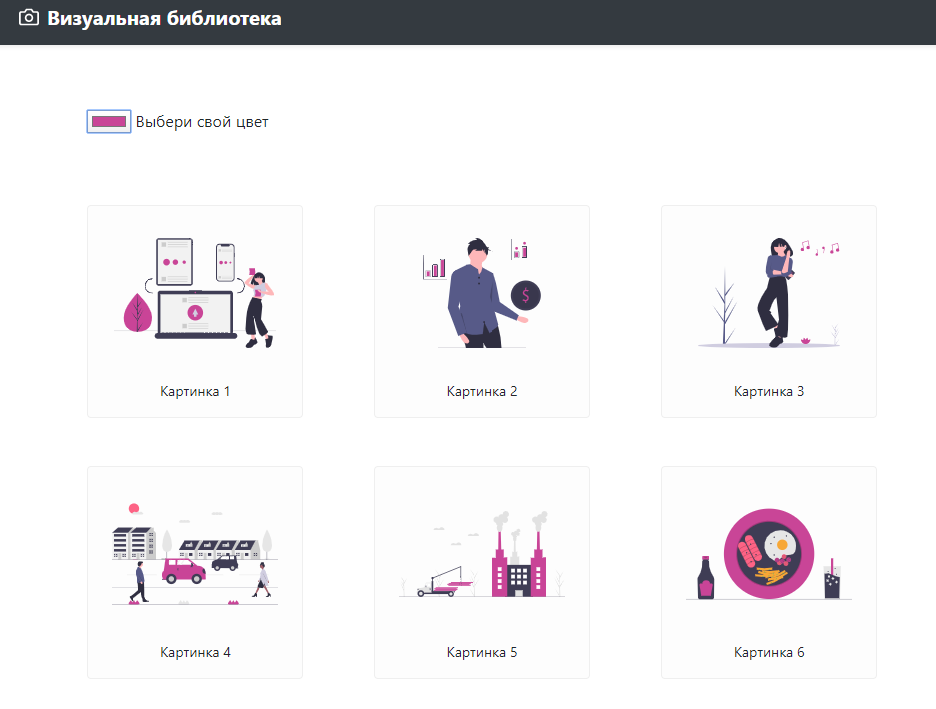
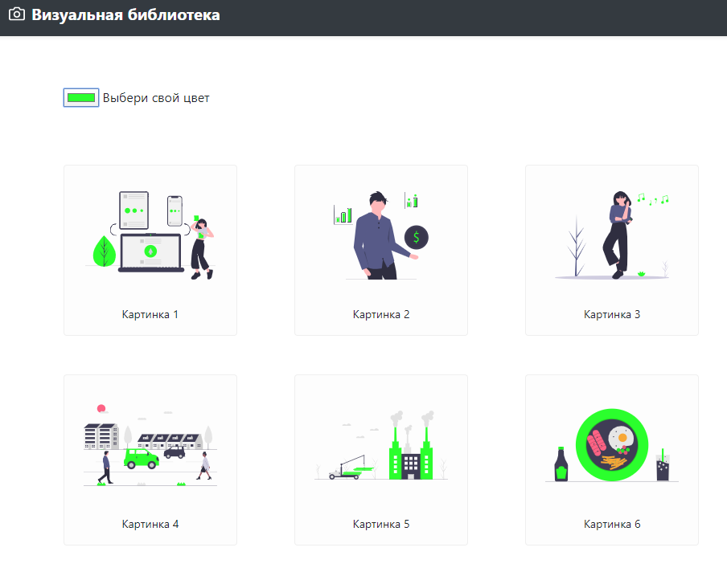
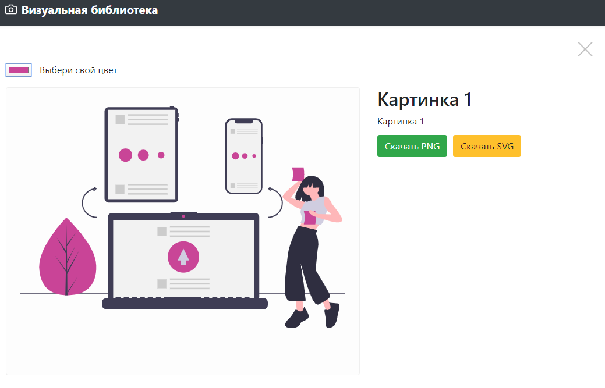

# Галерея визуальных образов

Галлерея визуальных образов с возможностью кастомизации цветовой палитры.

Позволяет выбрать изображение, иллюстрирующее ту или иную смысловую концепцию,
подобрать цет, наилучшим образом сочетающийся с цветовой палитрой вашего
проекта, а затем скачать файл с изображением в формате SVG или PNG.

## Интерфейс приложения

  

## Live Demo
[vl.bayborodin.ru](https://vl.bayborodin.ru)

## License

- **[MIT license](http://opensource.org/licenses/mit-license.php)**
- Copyright 2020 © <a href="http://bayborodin.ru" target="_blank">Nikolay Bayborodin</a>.
